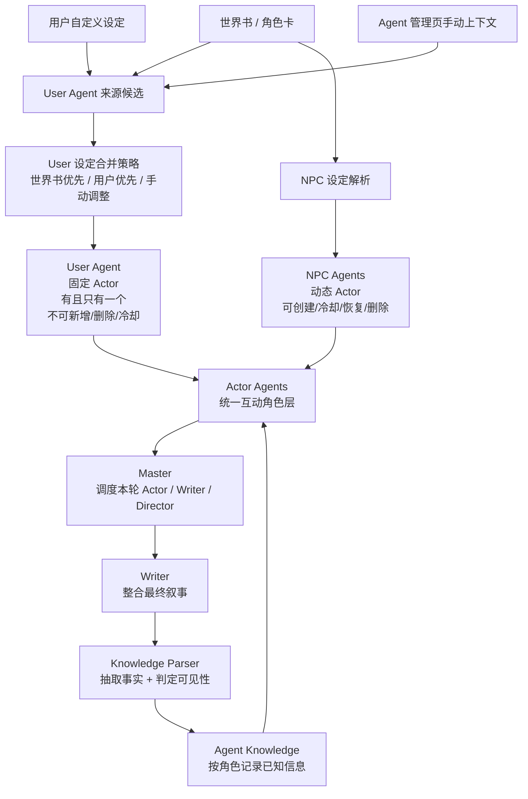
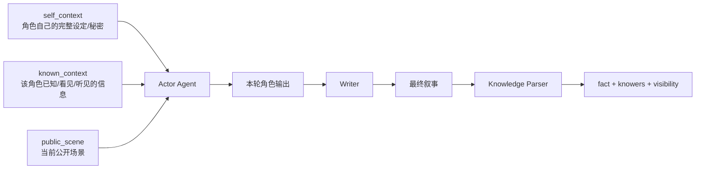
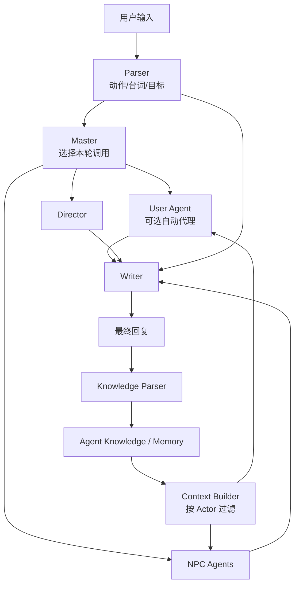

# Actor Agent Architecture

> 多 Agent RP 的互动角色架构。User Agent 和 NPC Agent 都是 Actor Agent；区别只在生命周期和设定来源。

- [文档中心](docs.md)
- [架构首页](index.md)
- [Agent Runtime](agent-runtime.md)
- [Agent 边界](agent-boundaries.md)

---

## Core Model

## Agent Types

| Type | Role | Lifecycle | Context Source |
|---|---|---|---|
| `user` | 用户扮演角色，固定 Actor Agent | 每个 multi-agent 会话有且只有一个；不可新增、删除、冷却 | 世界书用户角色资料、用户自定义 User Persona、Agent 管理页手动上下文 |
| `npc` | 动态 NPC Actor Agent | 可由 Master 或用户创建、冷却、恢复、删除 | 世界书、角色卡、Master 创建时提供的上下文、Agent 管理页手动上下文 |
| `writer` | 最终叙事合成 | 固定系统 Agent | 当前场景、Actor 输出、Director 建议、可用角色摘要 |
| `director` | 节奏和场景建议 | 固定系统 Agent | 场景状态、事件、伏笔 |
| `parser` | 用户输入解析 | 固定系统 Agent | 用户输入和短上下文 |
| `master` | 调度和生命周期决策 | 固定系统 Agent | Agent 摘要、Parser 输出、场景状态 |
| `state` | 状态/变量更新 | 固定系统 Agent | 用户输入、最终叙事、当前变量状态 |

## User Agent Rules

- User Agent 是 Actor Agent，不是特殊 prompt 片段。
- User Agent 自带存在，不能被用户或 Master 新增第二个。
- User Agent 不能被删除、冷却或自动回收。
- User Agent 的固定上下文可在 Agent 管理页直接编辑。
- User Agent 的配置来源可以来自世界书，也可以来自用户自定义设定。
- 当两个来源冲突时，应由用户选择合并策略：
  - `user_overrides_worldbook`
  - `worldbook_overrides_user`

## Context Boundary

Rules:

- 自我设定只给本人。
- 明确说出口的信息给听见的人。
- 明确可观察动作/表情给看见的人。
- 内心独白、秘密和未揭露动机只给本人和叙事层。
- Writer 可以知道更多，但角色不能凭空知道。
- 不确定是否可见时，不传给角色 Agent，只传给 Writer/Director。

## Turn Flow

## Current Implementation Notes

- `sub_agents.agent_type = 'user'` 表示固定 User Agent。
- `sub_agents.agent_type = 'npc'` 表示动态 NPC Actor。
- `sessions.config.user_persona` 是 User Agent 的一个配置来源。
- `sessions.config.user_setting_merge_strategy` 控制 User Persona 与世界书用户设定冲突时的优先级，当前支持 `user_overrides_worldbook` 和 `worldbook_overrides_user`。
- 保存会话 User Persona 时，后端会把 `user_persona` 与世界书 `category = "user"` 的条目合并后同步更新 `sub_agents` 中的 User Agent。
- `ContextBundle.role_contexts` 会加载 active 的 `npc/user` 角色上下文，供 Writer/Director/User Agent 使用。
- Context Builder 会动态重建 User Agent 上下文；已合并进 User Agent 的世界书用户条目不会再作为普通“世界书设定”注入 Actor/Writer 提示词。
- `agent_knowledge_events` 存储轮后 Knowledge Parser 提取出的 `fact + knowers + visibility`。
- Context Builder 会加载近期知识事件；Actor Agent 只收到自己可见的事实。
- Knowledge Parser 解析失败或输出非法 knower 时，事实会降级为 `writer_only`，不会传播给角色。
- Agent 管理 API 返回 `fixed` 标记；固定 User Agent 允许编辑上下文，但禁止创建、删除、冷却。
